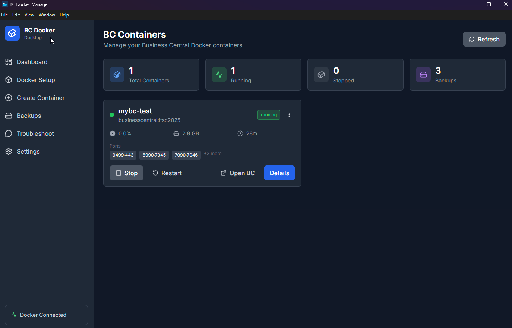
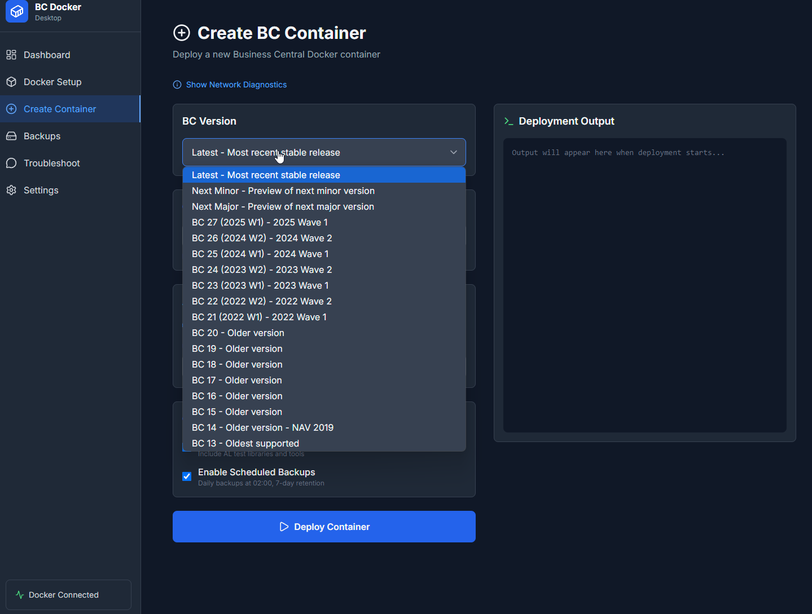
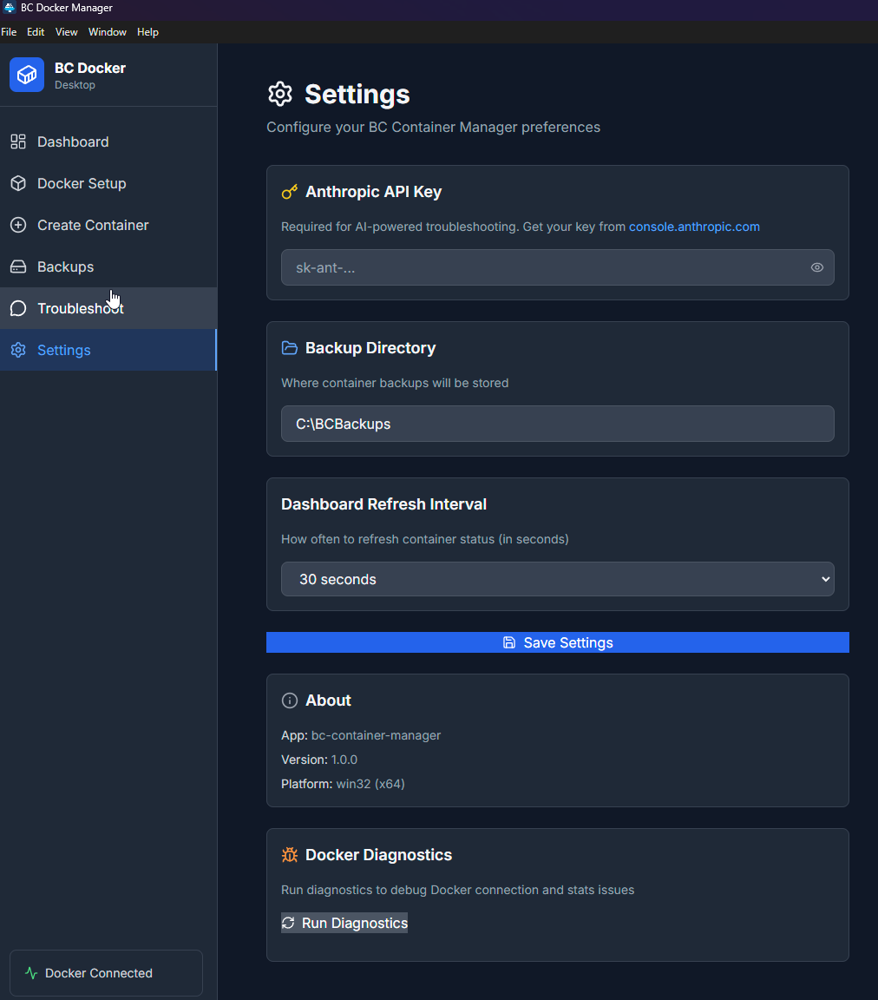

# BC Container Manager

> Electron + TypeScript desktop app for Dynamics 365 Business Central Docker containers with Claude AI troubleshooting, one-click deployment, and PowerShell integration.

[](https://github.com/azullus/bc-docker-manager/releases)
[](https://github.com/azullus/bc-docker-manager/actions/workflows/build-test.yml)
[](https://www.electronjs.org/)
[](https://nextjs.org/)
[](https://www.typescriptlang.org/)
[](LICENSE.txt)
[](https://github.com/azullus/bc-docker-manager/stargazers)
[](https://github.com/azullus/bc-docker-manager/issues)
[](https://github.com/azullus/bc-docker-manager/commits/main)

**Desktop app for:**
- 🐳 Business Central container lifecycle management
- 📊 Real-time log viewing and diagnostics
- 💾 Automated backup operations
- 🤖 AI-powered troubleshooting (Claude API)
- ⚡ One-click deployment via Install-BC-Helper.ps1

---

## 🚀 Quick Start

### Prerequisites

| Component | Requirement |
|-----------|-------------|
| **OS** | Windows 10/11 |
| **Docker** | Docker Desktop for Windows |
| **Node.js** | 18+ (for development) |
| **PowerShell** | 7.0+ (bundled scripts) |
| **Optional** | Anthropic API key (AI features) |

### Download & Install

**Option 1: Run Installer** (Recommended)
```bash
# Download from GitHub Releases
# Run: BC Container Manager-Setup-1.0.0.exe
# Follow installation wizard
```

**Option 2: Portable Executable**
```bash
# Download: BC Container Manager-Portable-1.0.0.exe
# Run directly without installation
```

### Development Setup

```bash
# Clone repository
git clone https://github.com/azullus/bc-docker-manager.git
cd bc-docker-manager

# Install dependencies
npm install

# Run Electron app in development mode
npm run electron:dev

# Or run as web app only
npm run dev
```

---

## 📸 Screenshots

### Dashboard
The main dashboard displays all Business Central containers with real-time status monitoring. View total containers, running/stopped counts, and backup statistics at a glance. Quick actions for Stop, Restart, Open BC, and container Details.



### Docker Setup
Prerequisites checker validates your environment before container deployment. Monitors Docker Engine status, BcContainerHelper module, Hyper-V, WSL 2, and system memory requirements. Quick links to documentation resources.


### Create Container
One-click container deployment with version selection. Configure container name, authentication mode, and options like Test Toolkit and scheduled backups. Real-time deployment output panel shows progress.


Choose from the latest stable release, preview versions, or specific BC versions (BC 13 through BC 27).



### Backups
Centralized backup management interface. Track total backups, storage usage, and view the most recent backup date. Create new backups with one click, restore from any backup, and delete old backups. Backups grouped by container.


### AI Troubleshooting
Claude-powered troubleshooting assistant for Business Central container issues. Quick action buttons for common problems: startup failures, performance issues, license problems, and extension errors. Context-aware suggestions based on your container configuration.


### Settings
Configure your BC Container Manager preferences. Set your Anthropic API key for AI features, specify backup directory location, and adjust dashboard refresh intervals. Includes Docker diagnostics tools and app version info.



---

## 🏗️ Architecture

### Electron Desktop App

```
┌─────────────────────────────────────────┐
│         Electron Main Process           │
│  ┌─────────────────────────────────┐   │
│  │   electron/main.js              │   │
│  │   - Window management           │   │
│  │   - IPC handlers                │   │
│  │   - PowerShell execution        │   │
│  └─────────────────────────────────┘   │
│              ↕ IPC                      │
│  ┌─────────────────────────────────┐   │
│  │   Renderer Process (Next.js)    │   │
│  │   - React components            │   │
│  │   - UI/UX                        │   │
│  │   - Client-side logic           │   │
│  └─────────────────────────────────┘   │
└─────────────────────────────────────────┘
         ↕                    ↕
   Docker API          PowerShell Scripts
```

**Key Files:**
- `electron/main.js` - Electron entry point, window creation
- `electron/preload.js` - Secure IPC bridge
- `electron/ipc-handlers.js` - Backend operations (Docker, backups, AI)
- `lib/electron-api.ts` - Unified API for renderer process

### Dual-Mode Support

The app works in two modes:

1. **Electron Mode** (Desktop) - Uses IPC for Docker/PowerShell operations
2. **Web Mode** (Fallback) - Uses Next.js API routes via fetch

---

## ✨ Features

### Container Management

- **Dashboard View** - All BC containers at a glance
- **Status Monitoring** - Real-time container state
- **Quick Actions** - Start, stop, restart, remove with one click
- **Port Mappings** - View exposed ports and services
- **Resource Stats** - CPU, memory, network usage

### Log Viewer

- **Real-time Streaming** - Live container logs
- **Search & Filter** - Find specific log entries
- **Export** - Save logs to file for analysis
- **Color-coded** - Error/warning/info highlighting

### Backup Management

- **Automated Backups** - Schedule container backups
- **Backup Browser** - View all existing backups
- **Restore Operations** - Restore from backup
- **Retention Policy** - Auto-delete old backups
- **Size Tracking** - Monitor backup disk usage

### AI Troubleshooting

Powered by Claude API:
- Diagnose container startup failures
- Suggest fixes for common BC issues
- License troubleshooting assistance
- Extension deployment guidance
- Performance optimization tips

**Context-aware**: AI has knowledge of Business Central Docker architecture and common issues.

### One-Click Deployment

Integrated PowerShell deployment:
```powershell
# Bundled script: scripts/Install-BC-Helper.ps1
# Deploys BC containers with:
- Automatic version selection
- License import
- Port configuration
- Database initialization
```

---

## 📂 Project Structure

```
bc-docker-manager/
├── electron/
│   ├── main.js              # Electron main process
│   ├── preload.js           # IPC bridge (secure)
│   ├── ipc-handlers.js      # Backend operations
│   └── rag-helper.js        # RAG integration for offline AI
│
├── app/                     # Next.js App Router
│   ├── dashboard/page.tsx   # Container list view
│   ├── setup/page.tsx       # Docker prerequisites checker
│   ├── create/page.tsx      # Container creation wizard
│   ├── container/page.tsx   # Container details view
│   ├── backups/page.tsx     # Backup management
│   ├── troubleshoot/page.tsx # AI chat interface
│   ├── settings/page.tsx    # App configuration
│   └── layout.tsx           # Main layout with sidebar
│
├── components/
│   ├── ContainerCard.tsx    # Container display component
│   ├── LogViewer.tsx        # Real-time log viewer
│   ├── AIChat.tsx           # AI chat interface
│   ├── DeploymentModal.tsx  # Container creation dialog
│   ├── HNSErrorRecovery.tsx # HNS error recovery UI
│   ├── NetworkDiagnostics.tsx # Network health diagnostics
│   ├── ErrorBoundary.tsx    # React error boundary
│   ├── Sidebar.tsx          # Navigation menu
│   └── Providers.tsx        # React context providers
│
├── lib/
│   ├── electron-api.ts      # Unified API layer
│   ├── docker-api.ts        # Docker Engine API (web mode)
│   ├── ai-client.ts         # Claude API integration
│   ├── hns-error-detector.ts # HNS error pattern detection
│   ├── types.ts             # TypeScript interfaces
│   └── deployment-context.tsx # Deployment state management
│
├── scripts/
│   ├── Deploy-BC-Container.ps1  # Direct Docker deployment (primary)
│   ├── Install-BC-Helper.ps1    # BcContainerHelper deployment (legacy)
│   ├── Fix-HNS-State.ps1        # HNS cleanup script
│   ├── Diagnose-HNS-Ports.ps1   # Network diagnostics
│   ├── Backup-BC-Container.ps1  # Backup operations
│   └── Restore-BC-Container.ps1 # Restore operations
│
├── screenshots/             # Application screenshots
│   ├── dashboard.png
│   ├── docker-setup.png
│   ├── create-container.png
│   ├── create-container-versions.png
│   ├── backups.png
│   ├── troubleshoot.png
│   └── settings.png
│
├── electron-builder.yml     # Electron build configuration
├── package.json             # Dependencies and scripts
└── README.md                # This file
```

---

## 🔧 Configuration

### Application Settings

Settings stored in: `%APPDATA%/bc-container-manager/settings.json`

```json
{
  "anthropicApiKey": "sk-ant-...",
  "backupRoot": "C:\\BCBackups",
  "autoRefreshInterval": 5000,
  "defaultContainerPrefix": "bcserver"
}
```

### Environment Variables (Development)

Create `.env.local` for development:

```env
# Anthropic API key (optional, for AI features)
ANTHROPIC_API_KEY=sk-ant-your-key-here

# Backup directory
BACKUP_ROOT=C:\BCBackups

# Docker socket (default for Windows)
DOCKER_HOST=//./pipe/docker_engine
```

---

## 🎯 Usage

### Creating a Container

1. Click **"New Container"** button
2. Select BC version (Latest, LTS, Specific)
3. Configure:
   - Container name
   - License file (optional)
   - Ports (Web Client, SOAP, OData, DEV)
   - Authentication mode
4. Click **"Deploy"** to run Install-BC-Helper.ps1
5. Monitor deployment progress in real-time

### Managing Containers

**Start/Stop:**
- Click power icon on container card
- Or use bulk actions from dashboard

**View Logs:**
- Click container name → Logs tab
- Search for errors or specific text
- Export to file for analysis

**Create Backup:**
- Container Details → Backups
- Click "Create Backup"
- Specify backup name and location

### AI Troubleshooting

1. Navigate to **Troubleshoot** page
2. Describe your issue in chat
3. AI provides context-aware suggestions
4. Follow recommended fixes
5. Run suggested PowerShell commands if needed

**Example queries:**
- "Container won't start after restart"
- "Getting license error on login"
- "Web client shows 404 error"
- "How do I import a BC extension?"

---

## 🛠️ Development

### Available Scripts

```bash
# Development (web only)
npm run dev              # Start Next.js dev server

# Development (Electron)
npm run electron:dev     # Start Electron + Next.js

# Building
npm run build            # Build Next.js static export
npm run electron:build:win      # Build Windows installer
npm run electron:build:portable # Build portable .exe

# Testing
npm test                 # Run Jest tests
npm run test:coverage    # With coverage report
npm run lint             # ESLint validation
```

### Build Output

After running `npm run electron:build:win`:

```
dist/
├── BC Container Manager-Setup-1.0.0.exe    # Installer (147 MB)
├── BC Container Manager-Portable-1.0.0.exe # Portable (145 MB)
└── win-unpacked/                            # Unpacked app files
```

---

## 🐳 Container Naming Convention

The app filters for containers with names containing `bc` (case-insensitive).

**Compatible naming:**
- `mybc-test`
- `bcserver-dev`
- `bc-production`
- `sandbox-bc25`

**Create with BcContainerHelper:**
```powershell
New-BcContainer -containerName "mybc-dev" `
    -artifactUrl (Get-BcArtifactUrl -type Sandbox -version "25.0") `
    -accept_eula
```

---

## 🧪 Testing

```bash
# Run all tests
npm test

# Watch mode
npm test -- --watch

# Coverage report
npm run test:coverage
```

**Test suites:**
- `__tests__/components/` - React component tests
- `__tests__/lib/` - Utility function tests

---

## 📡 API Reference

### IPC Channels (Electron Mode)

| Channel | Description | Parameters |
|---------|-------------|------------|
| `docker:list` | List containers | - |
| `docker:start` | Start container | `containerId` |
| `docker:stop` | Stop container | `containerId` |
| `docker:logs` | Get logs | `containerId, tail` |
| `powershell:run` | Execute script | `scriptPath, args` |
| `backup:create` | Create backup | `containerId, path` |
| `ai:chat` | Send AI message | `message, history` |

### REST Endpoints (Web Mode)

Fallback API routes for non-Electron usage:

| Endpoint | Method | Description |
|----------|--------|-------------|
| `/api/containers` | GET | List all containers |
| `/api/containers` | POST | Container action |
| `/api/logs` | GET | Container logs |
| `/api/backups` | GET | List backups |
| `/api/backups` | POST | Create backup |
| `/api/ai` | POST | AI chat |

---

## 🔒 Security

- **IPC Isolation**: Context isolation enabled in Electron
- **No eval()**: Secure script execution via spawn
- **API Keys**: Stored encrypted in %APPDATA%
- **Docker Socket**: Local access only (no remote exposure)

---

## 🔧 Troubleshooting

### Application Won't Start

**Issue**: Double-clicking the executable shows error or nothing happens

**Solutions**:

1. **Missing Dependencies**
   ```powershell
   # Check Node.js version
   node --version  # Should be 18.0.0 or higher

   # Check if Docker Desktop is running
   docker info
   ```
   - **Fix**: Install [Node.js 20+](https://nodejs.org/) or start Docker Desktop

2. **Electron Build Issues**
   ```bash
   # Clear build cache
   rm -rf node_modules .next dist
   npm install
   npm run build
   ```

3. **Port Conflict (Dev Mode)**
   - Default port 3000 may be in use
   - **Fix**: Kill process or change port in `package.json`
   ```bash
   # Find process using port 3000
   netstat -ano | findstr :3000
   # Kill process (replace PID)
   taskkill /PID <process_id> /F
   ```

### Docker Connection Issues

**Issue**: "Cannot connect to Docker daemon" error

**Solutions**:

1. **Docker Desktop Not Running**
   ```bash
   # Check Docker status
   docker ps

   # If error, start Docker Desktop
   # Windows: Start menu → Docker Desktop
   ```

2. **Docker Pipe Permissions**
   ```powershell
   # Test pipe access
   [System.IO.Directory]::GetFiles("\\.\pipe\") | Select-String docker

   # Should show: docker_engine
   ```
   - **Fix**: Restart Docker Desktop
   - **Fix**: Add user to docker-users group (Windows)

3. **WSL2 Backend Issues**
   - If using WSL2 backend
   - **Fix**: `wsl --update` and restart Docker

### Container Management Errors

**Issue**: Containers not appearing in dashboard

**Solutions**:

1. **Filter Pattern Mismatch**
   - App filters for containers with names containing `bc`
   - **Fix**: Rename containers to include "bc" in the name:
   ```powershell
   docker rename old-name mybc-container
   ```

2. **Container Status Polling Failed**
   - Check Docker API accessibility
   ```bash
   docker ps --format "{{.Names}}"
   ```
   - If works in CLI but not app, check IPC handlers

3. **Refresh Dashboard**
   - Click refresh icon or restart app
   - **Keyboard shortcut**: F5 (if implemented)

### AI Troubleshooting Not Working

**Issue**: AI chat returns errors or no response

**Solutions**:

1. **Missing API Key**
   - Go to Settings → Enter Anthropic API key
   - Get key from [Anthropic Console](https://console.anthropic.com/)

2. **API Key Invalid**
   ```bash
   # Test API key manually
   curl https://api.anthropic.com/v1/messages \
     -H "x-api-key: YOUR_KEY" \
     -H "anthropic-version: 2023-06-01"
   ```
   - **Fix**: Regenerate key in Anthropic Console

3. **Rate Limiting**
   - Anthropic free tier: Limited requests/minute
   - **Fix**: Wait 60 seconds or upgrade plan

4. **Network Issues**
   - Corporate firewall may block api.anthropic.com
   - **Fix**: Use VPN or whitelist domain

### PowerShell Script Failures

**Issue**: Install-BC-Helper.ps1 fails or doesn't run

**Solutions**:

1. **Execution Policy**
   ```powershell
   # Check current policy
   Get-ExecutionPolicy

   # Allow script execution (as Admin)
   Set-ExecutionPolicy -ExecutionPolicy RemoteSigned -Scope CurrentUser
   ```

2. **Missing BcContainerHelper Module**
   ```powershell
   # Install module
   Install-Module BcContainerHelper -Force

   # Verify installation
   Get-Module BcContainerHelper -ListAvailable
   ```

3. **Script Path Issues**
   - Scripts bundled in `scripts/` folder
   - **Fix**: Use absolute paths in IPC calls

4. **Admin Privileges Required**
   - Some Docker operations need admin
   - **Fix**: Run app as administrator (right-click → Run as administrator)

### Backup/Restore Issues

**Issue**: Backup creation fails or restore doesn't work

**Solutions**:

1. **Backup Path Not Writable**
   ```powershell
   # Test backup directory permissions
   Test-Path "C:\BC-Backups" -PathType Container
   New-Item -Path "C:\BC-Backups\test.txt" -ItemType File
   ```
   - **Fix**: Choose different backup location in Settings

2. **Container Not Running**
   - Cannot backup stopped container
   - **Fix**: Start container first, then backup

3. **Insufficient Disk Space**
   ```powershell
   # Check free space
   Get-PSDrive C | Select-Object Used,Free
   ```
   - **Fix**: Free up space or choose different drive

4. **Restore Overwrites Warning**
   - App should warn before overwriting
   - **Workaround**: Manually rename container before restore

### Build Errors

**Issue**: `npm run build` or `npm run electron:build` fails

**Solutions**:

1. **Dependency Issues**
   ```bash
   # Clear npm cache
   npm cache clean --force
   rm -rf node_modules package-lock.json
   npm install
   ```

2. **TypeScript Errors**
   ```bash
   # Run type check
   npx tsc --noEmit

   # Common fix: Update types
   npm install --save-dev @types/node@latest @types/react@latest
   ```

3. **Next.js Build Fails**
   ```bash
   # Check for syntax errors
   npm run lint

   # Build with verbose output
   npm run build -- --debug
   ```

4. **Electron Builder Fails**
   - **Windows**: Requires `electron-builder` dependencies
   ```bash
   # Install Windows build tools
   npm install --global windows-build-tools
   ```

### Logs and Debugging

**Check Application Logs:**
```bash
# Electron dev console
# Press F12 in app to open DevTools

# Check Next.js logs
npm run dev  # Shows server-side errors

# Check Electron main process logs
# Look in terminal where app was launched
```

**Enable Verbose Logging:**
```bash
# Set environment variable before launching
$env:DEBUG="*"
npm run electron:dev
```

**Common Log Locations:**
- Electron logs: `%APPDATA%/bc-container-manager/logs/`
- Backup logs: Check backup directory for `.log` files

---

## 📦 Technologies

| Layer | Technology |
|-------|-----------|
| **Desktop** | Electron Latest |
| **Framework** | Next.js 14 (App Router) |
| **Language** | TypeScript 5 |
| **Styling** | Tailwind CSS 3 |
| **Docker API** | Native IPC to PowerShell/Docker |
| **AI** | Anthropic Claude API |
| **Build** | electron-builder |
| **Testing** | Jest + React Testing Library |

---

## 🔗 Related Projects

### PowerShell & Automation
- **[cosmicbytez-ops-toolkit](https://github.com/azullus/cosmicbytez-ops-toolkit)** - PowerShell automation suite with Install-BC-Helper.ps1 and Docker management scripts
- **[CosmicPing](https://github.com/azullus/CosmicPing)** - .NET 8 C# network diagnostic tool for IT operations

### Infrastructure & Deployment
- **[docker-infrastructure](https://github.com/azullus/docker-infrastructure)** - Docker Compose IaC for self-hosted services with Traefik and monitoring
- **[cosmicbytez-homelab](https://github.com/azullus/cosmicbytez-homelab)** - Home lab infrastructure and media server documentation

### Security Operations
- **[cosmicbytez-secops](https://github.com/azullus/cosmicbytez-secops)** - Security operations, PNPT training, and ethical hacking resources

---

## 📝 License

MIT License - See [LICENSE.txt](LICENSE.txt) for details.

---

**Built by CosmicBytez for Business Central DevOps | Windows Desktop | Docker Orchestration**
